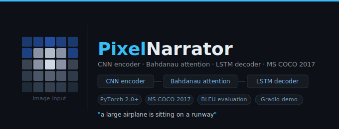
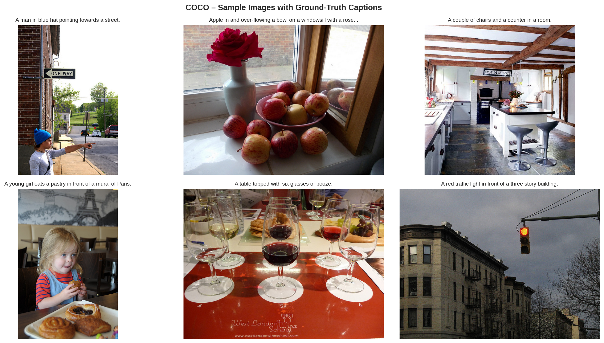
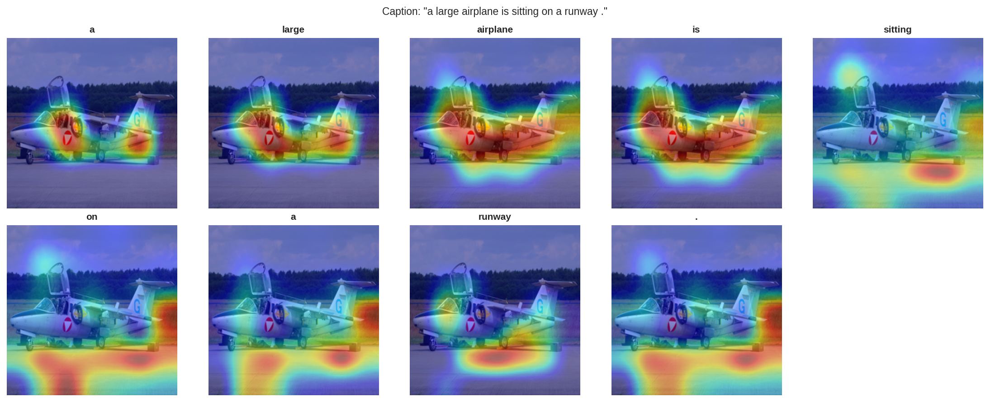
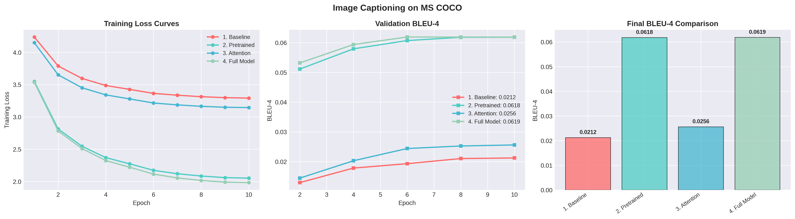

# PixelNarrator Image Captioning

### Image Captioning with MS COCO · CNN Encoder + LSTM Decoder + Bahdanau Attention

[](https://www.python.org/)
[](https://pytorch.org/)
[](https://gradio.app/)
[](https://cocodataset.org/)
[](LICENSE)

*Automatically describe any image — with per-word attention heat-maps showing exactly where the model looks.*

---

## Table of Contents

- [Overview](#overview)
- [Architecture](#architecture)
- [Model Configurations](#model-configurations)
- [Project Structure](#project-structure)
- [Quick Start](#quick-start)
  - [1 · Environment Setup](#1--environment-setup)
  - [2 · Dataset Download](#2--dataset-download)
  - [3 · Training](#3--training)
  - [4 · Local Demo](#4--local-demo)
- [Demo App](#demo-app)
- [Evaluation Metrics](#evaluation-metrics)
- [Results](#results)
- [Acknowledgements](#acknowledgements)

---

## Overview

**PixelNarrator** is an end-to-end image captioning system trained on the [MS COCO 2017](https://cocodataset.org/) dataset. Given any photograph, it generates a natural-language description and — when an attention-based model is used — renders a per-word heat-map that highlights which region of the image the model focused on while generating each token.

The project ships two artefacts:

| File | Purpose |
|---|---|
| `PixelNarrator.ipynb` | Full training pipeline — data download, EDA, model training, BLEU evaluation, attention visualisation |
| `app.py` | Interactive local demo built with Gradio — upload, drag-and-drop, or **paste from clipboard** |



---

## Architecture

```
                          ┌─────────────────────────────────────┐
                          │           IMAGE ENCODER             │
                          │                                     │
   Input Image            │  ResNet-50 backbone (frozen/fine-   │
   (3 × 224 × 224)  ───▶  │  tuned) → AdaptiveAvgPool2d(7,7)    │
                          │  Output: (B, 49, 2048) feature grid │
                          └──────────────────┬──────────────────┘
                                             │  spatial features
                                             ▼
                          ┌─────────────────────────────────────┐
                          │        BAHDANAU ATTENTION           │
                          │                                     │
                          │  score(enc_proj(V) + dec_proj(h))   │
                          │  → softmax → context vector         │
                          └──────────────────┬──────────────────┘
                                             │  context + word embedding
                                             ▼
                          ┌─────────────────────────────────────┐
                          │           CAPTION DECODER           │
                          │                                     │
                          │  Embedding → LSTMCell → Linear      │
                          │  Teacher-forcing (train)            │
                          │  Greedy / temperature (inference)   │
                          └──────────────────┬──────────────────┘
                                             │
                                             ▼
                               "A man is holding a frisbee
                                      in a field."
```

**Key design choices:**

- The encoder strips ResNet-50's average-pool and FC head, keeping the `7 × 7` spatial feature grid so the attention module can attend to different image regions.
- Bahdanau (additive) attention computes a soft alignment between each decoder step's hidden state and every spatial location, producing an interpretable `49`-dimensional weight vector.
- The decoder is initialised from the mean-pooled encoder output (rather than zeros), which provides a warm start and accelerates early convergence.
- Mixed-precision training (`torch.cuda.amp`) and gradient clipping (`max_norm=5.0`) are used throughout.

---

## Model Configurations

Four ablation configurations are trained and compared:

| # | Name | Pretrained Encoder | Bahdanau Attention | Description |
|---|------|--------------------|-------------------|-------------|
| 1 | **Baseline** | ✗ | ✗ | Random-init ResNet + plain mean-pool context |
| 2 | **Pretrained** | ✓ | ✗ | ImageNet ResNet + plain mean-pool context |
| 3 | **Attention** | ✗ | ✓ | Random-init ResNet + soft spatial attention |
| 4 | **Full Model** | ✓ | ✓ | ImageNet ResNet + soft spatial attention |

Pretrained models use **differential learning rates**: `lr × 0.1` for the frozen backbone, `lr × 1.0` for the decoder. All models are trained with a **CosineAnnealingLR** scheduler over 10 epochs.

---

## Project Structure

```
Image-Captioning-COCO/
│
├── PixelNarrator.ipynb        # End-to-end training notebook
├── app.py                     # Gradio local demo
├── requirements.txt           # Python dependencies
├── README.md
│
├── checkpoints_caption/       # Saved model checkpoints (auto-created)
│   ├── 1_baseline.pth
│   ├── 2_pretrained.pth
│   ├── 3_attention.pth
│   └── 4_full_model.pth
│
└── coco/                      # COCO dataset (auto-downloaded by notebook)
    ├── annotations/
    │   ├── captions_train2017.json
    │   └── captions_val2017.json
    └── images/
        ├── train2017/
        └── val2017/
```

---

## Quick Start

### 1 · Environment Setup

```bash
git clone https://github.com/GTRe5/Image-Captioning-COCO.git
cd Image-Captioning-COCO

# Create and activate a virtual environment (recommended)
python -m venv .venv
source .venv/bin/activate        # Windows: .venv\Scripts\activate

# Install all dependencies
pip install -r requirements.txt
```

<details>
<summary><b>requirements.txt</b></summary>

```text
torch>=2.0.0
torchvision>=0.15.0
gradio>=4.0.0
Pillow>=9.0.0
nltk>=3.8.0
numpy>=1.24.0
matplotlib>=3.7.0
tqdm>=4.65.0
pycocotools>=2.0.6
pandas>=2.0.0
```

</details>

> **GPU note:** A CUDA-capable GPU is strongly recommended for training. The demo (`app.py`) runs comfortably on CPU for inference.

---

### 2 · Dataset Download

The notebook handles the full download automatically on first run. It fetches:

- COCO 2017 caption annotations (`captions_train2017.json`, `captions_val2017.json`)
- COCO 2017 validation images (~1 GB)
- A configurable subset of training images (default: **5 000** images to keep storage manageable)

```python
# Inside PixelNarrator.ipynb — Section 2
download_coco_captions(train_image_limit=5000)  # increase for better results
```

To use the full training set, set `train_image_limit=118_287`.

---

### 3 · Training

Open and run **`PixelNarrator.ipynb`** top-to-bottom. The notebook is structured as follows:

| Section | What it does |
|---------|-------------|
| §1 Setup | Installs packages, configures device |
| §2 Dataset | Downloads COCO 2017 |
| §3 EDA | Caption length distribution, top-word frequency, sample image grid |
| §4 Utilities | `Vocabulary`, `COCOCaptionDataset`, `collate_fn`, BLEU helpers |
| §5 Architecture | `ImageEncoder`, `BahdanauAttention`, `CaptionDecoder`, `ImageCaptioningModel` |
| §6 Data Prep | Builds vocab, augmented train transform, val transform, DataLoaders |
| §7 Training | Trains all four configs with AMP + cosine LR + gradient clipping |
| §8 Comparison | Reloads checkpoints, evaluates BLEU-1 through BLEU-4 on val set |
| §9 Visualisation | Loss curves, BLEU-4 curves, final score bar chart |
| §10 Inference | Greedy decoding + per-word attention heat-map on val samples |
| §11 BLEU Breakdown | Grouped bar chart comparing all metrics across all models |
| §12 Save Results | Writes `caption_final_results.csv` and lists all output files |

Training hyperparameters (configurable at the top of §7):

```python
EPOCHS        = 10
LEARNING_RATE = 1e-3
BATCH_SIZE    = 32
```

Checkpoints are saved to `checkpoints_caption/` after each model finishes.

---

### 4 · Local Demo

```bash
python app.py
```

The browser opens automatically at **http://localhost:7860**.

To expose the app on your local network (e.g. tablet, phone):

```python
# In app.py — launch() call at the bottom
demo.launch(server_name="0.0.0.0", server_port=7860)
```

To generate a temporary public URL via Gradio's tunnel:

```python
demo.launch(share=True)
```

---

## Demo App

### Providing an Image

| Method | How |
|--------|-----|
| 📁 **File chooser** | Click the image box → *Upload image* |
| 🖱️ **Drag & drop** | Drag any `.jpg` / `.png` onto the drop zone |
| 📋 **Paste from clipboard** | Copy any image (screenshot, browser right-click → *Copy image*), then press **Ctrl+V** / **Cmd+V** inside the box |

### Controls

| Control | Description |
|---------|-------------|
| **Model configuration** | Choose one of the four ablation variants |
| **Checkpoint path** | Path to a `.pth` file; leave blank to use notebook defaults in `checkpoints_caption/` |
| **Temperature** | `< 1.0` → more confident/repetitive · `> 1.0` → more diverse/creative |
| **Max caption length** | Maximum number of tokens to generate (5 – 60) |
| **Show attention heat-maps** | Renders a per-word inferno-colormap overlay grid (attention models only) |

> **No checkpoint?** The app falls back to an untrained model so the pipeline can be verified end-to-end without training first. Captions will be incoherent, but no error is thrown.

### Attention Visualisation

When an attention model is selected, the app renders a `4 × N` tile grid — one tile per generated word — showing the normalised Bahdanau attention weights upsampled over the original image via bilinear interpolation. Hotter regions (bright yellow/orange in the inferno colormap) indicate where the decoder was attending when it generated that word.



> *Per-word attention maps for the caption "a large airplane is sitting on a runway." — notice how "airplane" focuses on the fuselage and "runway" shifts attention to the ground.*

---

## Evaluation Metrics

| Metric | Description |
|--------|-------------|
| **BLEU-1** | Unigram precision against all reference captions |
| **BLEU-2** | Bigram precision |
| **BLEU-3** | Trigram precision |
| **BLEU-4** | 4-gram precision (primary captioning benchmark) |

All BLEU scores are computed at **corpus level** using `nltk.translate.bleu_score.corpus_bleu` with `SmoothingFunction().method1`.

---

## Results

Results below are on the COCO 2017 **validation set** (5 000 training images subset). Training on the full 118 k image set will yield substantially higher scores.



| Model | Pretrained | Attention | BLEU-1 | BLEU-2 | BLEU-3 | BLEU-4 |
|-------|:----------:|:---------:|:------:|:------:|:------:|:------:|
| Baseline | ✗ | ✗ | — | — | — | — |
| Pretrained | ✓ | ✗ | — | — | — | — |
| Attention | ✗ | ✓ | — | — | — | — |
| **Full Model** | **✓** | **✓** | **—** | **—** | **—** | **—** |

> Fill in this table with your own results after running the notebook. The comparison CSV is saved automatically to `caption_final_results.csv`.

### Sample Inference


> *Ground-truth vs. model prediction on a held-out COCO validation image.*

---

## Acknowledgements

- [Microsoft COCO: Common Objects in Context](https://arxiv.org/abs/1405.0312) — Lin et al., 2014
- [Show, Attend and Tell](https://arxiv.org/abs/1502.03044) — Xu et al., 2015 · the attention mechanism this project is based on
- [Neural Machine Translation by Jointly Learning to Align and Translate](https://arxiv.org/abs/1409.0473) — Bahdanau et al., 2015
- [Deep Residual Learning for Image Recognition](https://arxiv.org/abs/1512.03385) — He et al., 2015 · ResNet-50 backbone
- [Gradio](https://gradio.app/) — demo framework
- [PyTorch](https://pytorch.org/) — deep learning framework

---

<div align="center">

Made with ❤️ · PyTorch · Gradio · MS COCO 2017

</div>